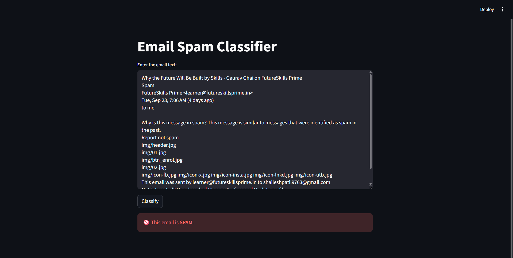

# Email Spam Classifier
[TRY Website](https://email-spam-or-ham-classifier.streamlit.app/)
## 📖 Overview

This project is a machine learning-based Email Spam Classifier. It uses Natural Language Processing (NLP) techniques to preprocess email text and a Multinomial Naive Bayes model to classify an email as either "Spam" or "Ham" (Not Spam). The project includes a Jupyter Notebook detailing the model development process and a simple, interactive web application built with Streamlit for real-time classification.

## ✨ Features

  - **Data Cleaning**: Handles missing values and duplicate entries in the dataset.
  - **Exploratory Data Analysis (EDA)**: Analyzes and visualizes the dataset to understand the characteristics of spam vs. ham emails.
  - **Text Preprocessing**: Implements a robust NLP pipeline including lowercasing, tokenization, stopword removal, and stemming.
  - **Feature Extraction**: Converts text data into numerical vectors using the TF-IDF (Term Frequency-Inverse Document Frequency) technique.
  - **Machine Learning Model**: Utilizes a Multinomial Naive Bayes classifier, which is highly effective for text classification tasks.
  - **Web Application**: A user-friendly interface built with Streamlit that allows users to input any email text and get an instant classification.

## ⚙️ How It Works

The model is built and trained following these steps, as detailed in the `email_spam_detection.ipynb` notebook:

1.  **Data Loading & Initial Analysis**:

      - The model is trained on the `spam_mail.csv` dataset.
      - The dataset consists of two columns: `Category` (spam/ham) and `Masseges` (the email text).
      - Initial analysis shows an imbalanced class distribution, with more ham emails than spam.

2.  **Data Cleaning & EDA**:

      - The dataset is checked for missing values and duplicates, which are subsequently removed.
      - The categorical labels ('ham', 'spam') are converted to numerical labels (0, 1) using `LabelEncoder`.
      - New features like the number of characters, words, and sentences are engineered for both classes. EDA reveals that spam messages tend to have more characters and words on average than ham messages.
      - Word clouds and bar plots are generated to visualize the most frequent words in both spam and ham emails.

3.  **Text Preprocessing**:

      - A function `transform_text` is created to clean the email text. This function performs:
        1.  **Lowercasing**: Converts all text to lowercase.
        2.  **Tokenization**: Splits the text into a list of words.
        3.  **Alphanumeric Filtering**: Removes special characters and punctuation.
        4.  **Stopword Removal**: Eliminates common English stopwords (e.g., "the", "a", "in").
        5.  **Stemming**: Reduces words to their root form using the Porter Stemmer (e.g., "loving" becomes "love").

4.  **Model Building**:

      - The preprocessed text data is transformed into a numerical format using `CountVectorizer` followed by `TfidfTransformer` to get TF-IDF vectors.
      - The data is split into training and testing sets (80-20 split).
      - A **Multinomial Naive Bayes (MultinomialNB)** model is trained on the data. This model was chosen for its high precision and excellent performance on text data.
      - The model achieves an **accuracy of \~96%** and a **precision of 1.0** on the test set, indicating it is very effective at correctly identifying spam without misclassifying ham emails.

5.  **Model Export**:

      - The trained TF-IDF vectorizer and the MultinomialNB model are saved into `.pkl` files using `pickle` for use in the web application.

## 🖥️ Screenshots

Here are some screenshots of the Streamlit web application interface.

**Not Spam Classification:**


**Spam Classification:**


## 🛠️ Technologies Used

  - **Python**: Core programming language.
  - **Pandas & NumPy**: For data manipulation and numerical operations.
  - **Scikit-learn**: For model building, training, and evaluation.
  - **NLTK (Natural Language Toolkit)**: For NLP tasks like tokenization, stopword removal, and stemming.
  - **Matplotlib & Seaborn**: For data visualization in the notebook.
  - **WordCloud**: For generating word cloud visualizations.
  - **Streamlit**: For building the interactive web application.
  - **Jupyter Notebook**: For model development and experimentation.

## 📦 Setup and Installation

To run this project locally, follow these steps:

1.  **Clone the repository:**

    ```bash
    git clone <repository-url>
    cd email-spam-classifier
    ```

2.  **Create and activate a virtual environment (recommended):**

    ```bash
    python -m venv venv
    source venv/bin/activate  # On Windows, use `venv\Scripts\activate`
    ```

3.  **Install the required libraries:**

    ```bash
    pip install -r requirements.txt
    ```

    *If `requirements.txt` is not available, install the packages manually:*

    ```bash
    pip install streamlit pandas numpy scikit-learn nltk matplotlib seaborn wordcloud
    ```

4.  **Download NLTK data:**
    Run the following commands in a Python interpreter:

    ```python
    import nltk
    nltk.download('punkt')
    nltk.download('stopwords')
    ```

5.  **Run the Streamlit application:**

    ```bash
    streamlit run app.py
    ```

    This will open the web application in your default browser.

## 📂 File Structure

```
.
├── app.py                      # Main Streamlit application file
├── email_spam_detection.ipynb  # Jupyter Notebook for model development
├── models/
│   ├── model.pkl               # Saved MultinomialNB model
│   └── vectorizer.pkl          # Saved TF-IDF vectorizer
├── static/
│   ├── spam_mail.csv           # Dataset used for training
│   ├── NOT SPAM.png            # UI screenshot
│   └── SPAM.png                # UI screenshot
└── README.md                   # This README file
```
